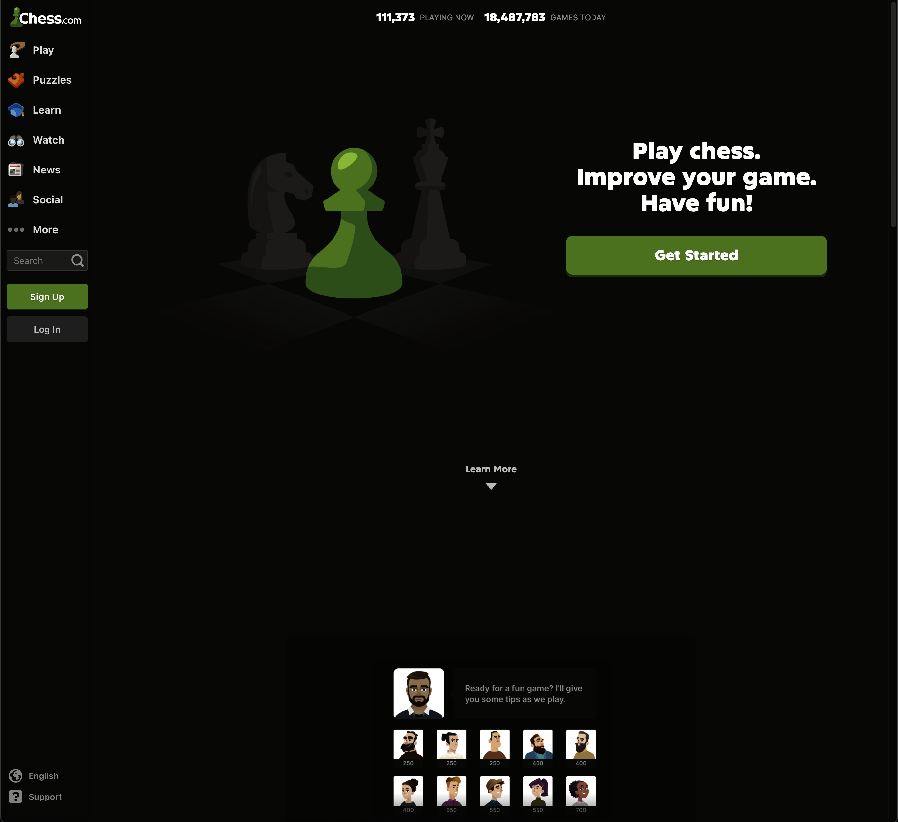
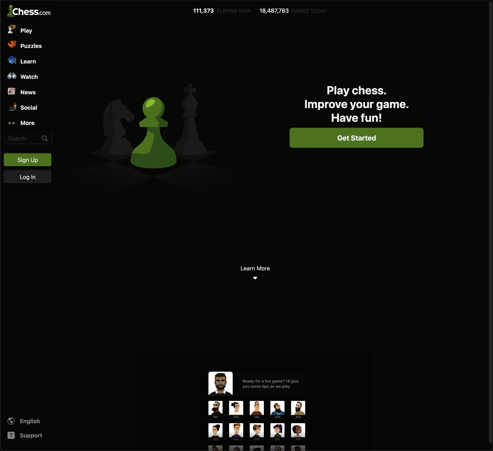

## Don't Reinvent the Wheel
For the past week I've been learning the basics of [Bootstrap 5](https://getbootstrap.com/), a popular CSS UI framework, in my software engineering class. A UI framework is essentially a software package that allows you to easily import and utilize premade visual components and styling options. Much like programming languages, UI frameworks do have a slight barrier to entry before you can create something useful. In the case of Bootstrap 5, I mean *very* slight. It surprised me to learn that the process for using one of Bootstrap's components is as easy as linking its stylesheet then attributing one of its special CSS classes to an HTML element. As you can probably guess, this streamlines the process of creating appealing webpages, and is a big step up from using raw HTML and CSS. Instead of spending an hour figuring out how to lay out a webpage and relearning CSS Flexbox, with Bootstrap you can just slap the "container" class on a parent div and then use the "row" and "col" classes to quickly create a nice (and dynamic) layout. To me, using Bootstrap—or any other UI framework—perfectly encapsulates the header of this section: don't reinvent the wheel.

For me, the only caveat I have with Bootstrap is the fact that it has very limited styling options. Oftentimes I find myself having to write custom CSS to really dial in the styling that I want, which can be difficult since often it requires remembering to use the "!important" rule or navigating nested Bootstrap classes to select the right one to syle. At the end of the day, I still find this to be a more appealing workflow than creating everything from scratch as with raw HTML and CSS.

## Putting it Into Practice
Recently, I utilized Bootstrap 5 to recreate the [Chess.com](https://www.chess.com/) website. Coding up this website was challenging since it implements a vertical navbar on the left side of the page, which is different from the websites we had practiced recreating in class. Ultimately, I utilized Bootstrap's grid layout to handle the spacing. Although it isn't exactly on the dot, the following is the result:

    

        

            
Original:

            
        

        

            
Recreation:

            
        

    

