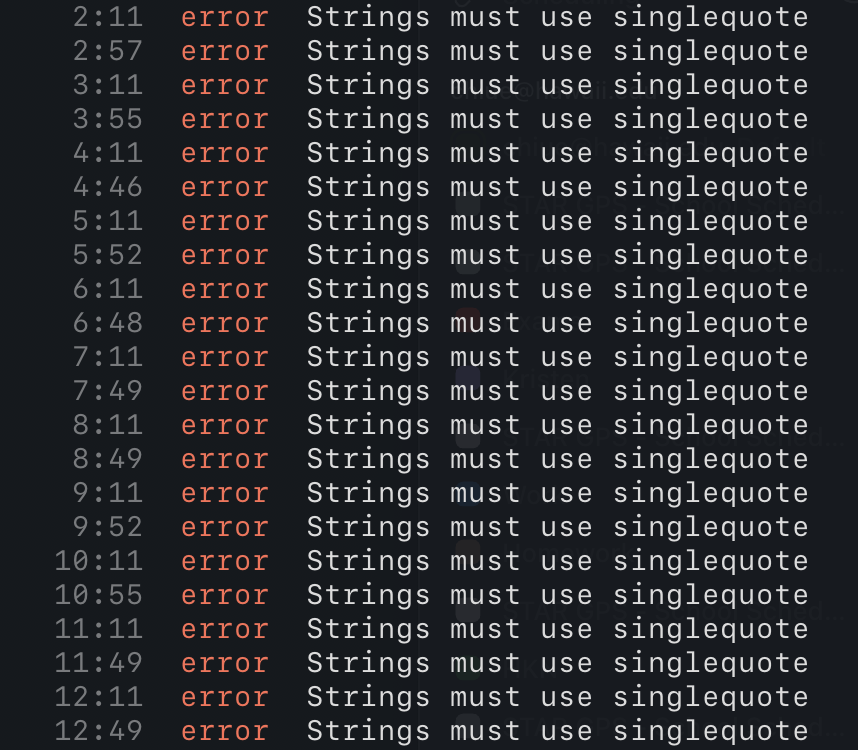

## Did I Format This Right?

As someone who has experience templating and formatting Python code, I understand the importance of having standardization when creating programs. For me, it is useful to have a "ground truth" when programming since it eliminates the need to think about how to structure my code, freeing up my mental energy for thinking about more important aspects of the program, like its functionality. This is the motivation of one of my favorite Python formatters, [Black](https://github.com/psf/black), which is described as an "uncompromising formatter" due to the fact that it formats code to a strict style. Black's firm policing of code style saves the time and energy of developers so they can focus on content instead.

Additionally, I've found that adhering to style guides and using linters actually helps me learn programming languages faster. For example, when I code in Python, I often refer to the [Google Python Style Guide](https://google.github.io/styleguide/pyguide.html). By having this standard to reference, I spend less time questioning whether I am using the correct convention and spend more time coding.

In [ICS 314](https://courses.ics.hawaii.edu/ics314f25/index.html), I'm currently learning about [ESLint](https://eslint.org/), a formatter for Javascript which also provides support for the latest versions of Typescript. In this class, we adhere to an [extension](https://github.com/iamturns/eslint-config-airbnb-typescript) of the [Airbnb Javascript Style Guide](https://github.com/airbnb/javascript) that configures ESLint to support Typescript. My first impression of linting Typescript is that it reminds me a lot of linting Python. In both cases, there are strict rules for whitespaces, line lengths, unused variables, and more. Although it can be painful having to pick through each error that ESLint throws, especially under the time pressure of WODs (timed coding quizzes), I've found that it really helps to improve the readability and consistency of my code, which is arguably one of the most important aspects of a program, especially when working with a team.

So far, my workflow has been writing a significant portion of the program, running the linter, fixing any errors it throws, then repeating. I find that this strikes a good balance between maintaining readability for myself and giving myself enough time to work on the "meat" of the program.

## Pros vs. Cons
Up until now, I've only touched on the benefits of formatting code; however, there are also drawbacks to be considered. For example, if you're working on a team, there may be disagreements about which style to use, or which formatter to include in the CI/CD pipeline. And if you're working by yourself, your custom formatting may be clearer to you than whatever the code formatter formats your code into. Without a formatter, you can fully preserve your "artistic freedom."

Ultimately, I feel that utilizing a formatter is the better call. The standardization and extra time and energy using a formatter allows outweighs the (often distracting) freedom that abstaining from it provides.
