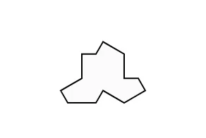
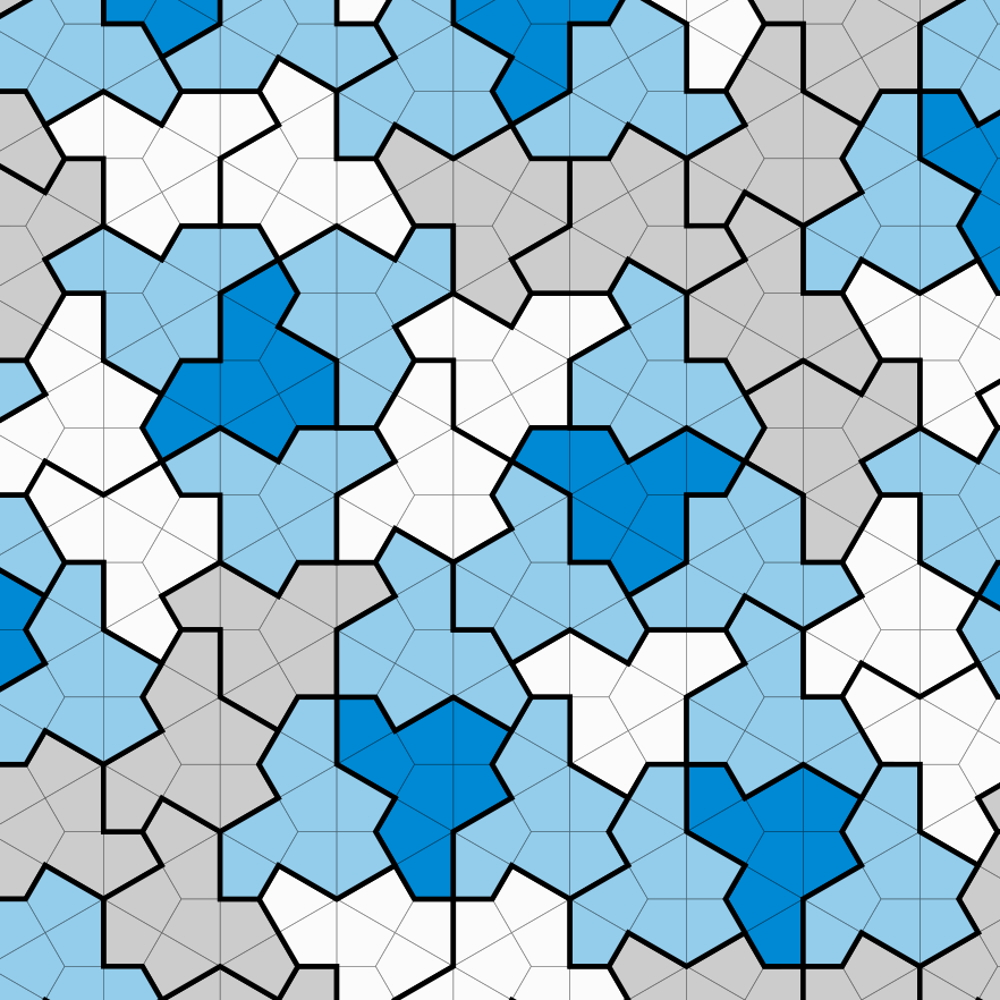

## P Pa Pat Patte Patterns

The einstein tile, as pictured to the right, is a deceptively ordinary-looking 13-sided shape. However, if you went and printed out a hundred, a thousand, even a trillion of them, laid them out, and fit them together like a puzzle, you'd discover something amazing: the patterns they form would never repeat.

This is because the einstein tile is a one-shape solution to the aperiodic tiling problem; in other words, it could fill an infinitely large plane without ever creating a repeating pattern. Fun fact: it's fittingly named not after the German scientist, but rather after the German words *ein Stein*, or "one stone".

## Designer

In many ways, the einstein tile reminds of high quality code. Like the unique shape, a useful piece of code can be reused again and again in many different orientations to fulfill a seemingly infinite number of needs. For this reason, the average programmer rarely needs to write truly novel code. The majority of what's written today is founded on previous work, and design patterns are a clear reflection of this. Design patterns are "guides" that software developers use to solve common challenges, improve code structure, define a universal language, and more.

In ICS 314, I've been working with my team to develop [RIBows](https://ri-bows.vercel.app/), a website dedicated to helping UH students search for, discover, and join Registered Independent Organizations (RIOs) on campus. Through the process of creating this site, I've encountered multiple design patterns, and even unknowingly implemented some that I had never heard about before.
