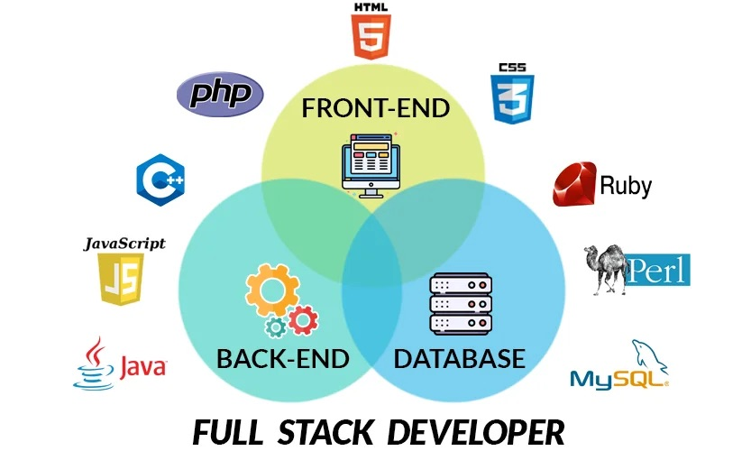

## In the Beginning...

I've been fascinated by software ever since I obtained my first laptop, an old and clunky Macbook Air. I pushed that machine to its limits, installing random games and apps, applying mods, and messing with its filesystem. After many years, the system eventually broke down and I lost all the stored data on the computer. Although I was initially distraught, this experience taught me an important lesson: understand what you're doing and why you're doing it. From that point on, I've been working to improve my understanding of the intricacies of both hardware and software systems.

## Getting Stacked

Full-stack development is the action of putting together a whole software application through the development of both the front-end and back-end. Recently, I've been focusing on improving my knowledge in this area by taking a software engineering course and working on personal projects. For one of my projects I am developing a mobile application using the Flutter framework and Dart language, and I've quickly learned that the declarative style of front-end programming is very different from the imperative style of coding I am more familiar with. This is coupled by my software engineering course, in which we are learning about the language Typescript, with the current focus being on the functional programming paradigm. Although I am treading unfamiliar territory, I am excited to learn more about front-end programming and improving my understanding of software development as a whole.
