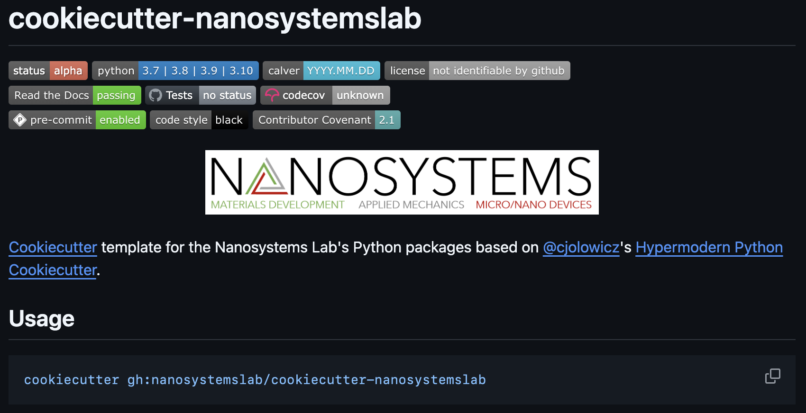
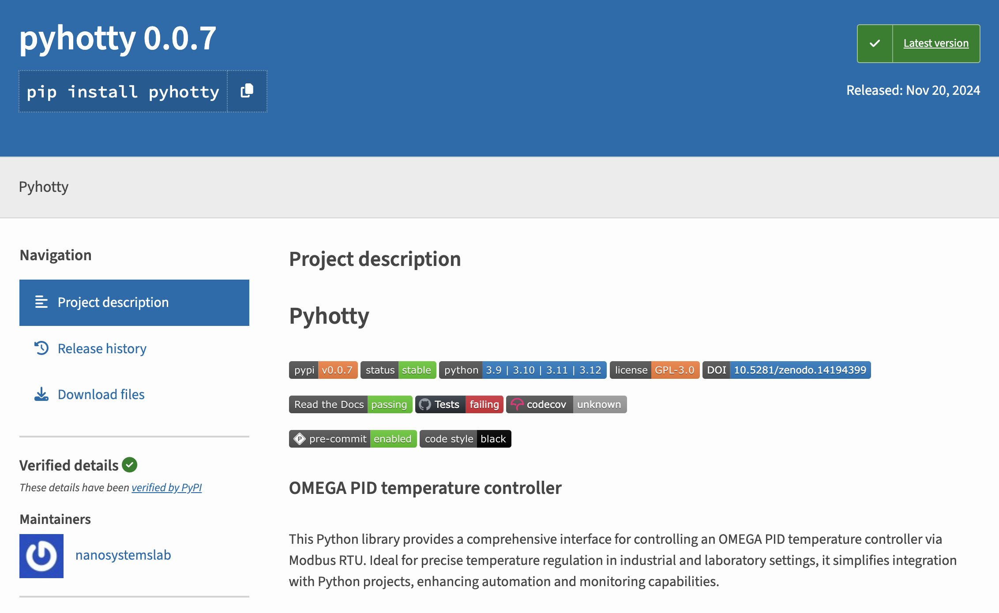

    

The Nanosystems Lab Cookiecutter is a template that I developed for my ENGR 296 vertically integrated project (VIP). The template uses the [Cookiecutter](https://github.com/cookiecutter/cookiecutter) command-line utility in conjunction with packaging and dependency management ([Poetry](https://python-poetry.org/)), testing ([Nox](https://nox.thea.codes/en/stable/) and [Pytest](https://docs.pytest.org/en/stable/)), CI/CD ([Github Actions](https://github.com/features/actions)), documentation ([Sphinx](https://www.sphinx-doc.org/en/master/)) and publishing tools ([PyPI](https://pypi.org/)), among others, to accelerate the process of creating—and deploying broadly—Python packages developed by and for the Nanosystems Laboratory in the Department of Mechanical Engineering at the University of Hawaii at Manoa.

After realizing the template, I applied it to several of the lab's existing lab automation Python packages, all of which are now published on the PyPI site and available for widespread use. Part of this process also involved writing unit tests for each package to validate their functionality.

The following is a screenshot of one of the published libraries on PyPI:

    

