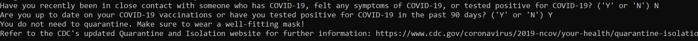

<div class="text-center p-4">
  
</div>

The Covid Questionnaire is a small project that I created during the COVID-19 pandemic as my submission to NVIDIA's Jetson A.I. Specialist certification program. The project utilizes the SSD-MobileNet-v2 object detection model running on a Jetson Nano to automatically detect a person with a webcam, present them with a questionnaire relating to relevant behaviors, and provide them the recommended protocol to follow, along with a link to the CDC's updated Quarantine and Isolation website.

Although the program is relatively simple, it served as a good introduction to Python and machine learning, and provided me motivation to learn despite the uncertain times of the COVID-19 pandemic.

The following is a snippet of the script showing how the objection detection model and camera are initialized, as well as how the person COCO class detection is utilized.

```python
net = jetson.inference.detectNet("ssd-mobilenet-v2", threshold=0.5)
camera = jetson.utils.videoSource("/dev/video0")
display = jetson.utils.videoOutput("display://0")

while display.IsStreaming():
	img = camera.Capture()
	detections = net.Detect(img)
	display.Render(img)
	display.SetStatus("Object Detection | Network {:.0f} FPPS".format(net.GetNetworkFPS()))
    time.sleep(2)

	# deploys questionnaire when person is detected in detection
	for detection in detections:
		if net.GetClassDesc(detection.ClassID) == "person":
            # ...
```
