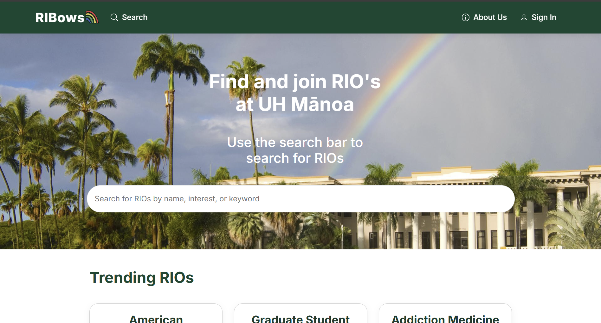
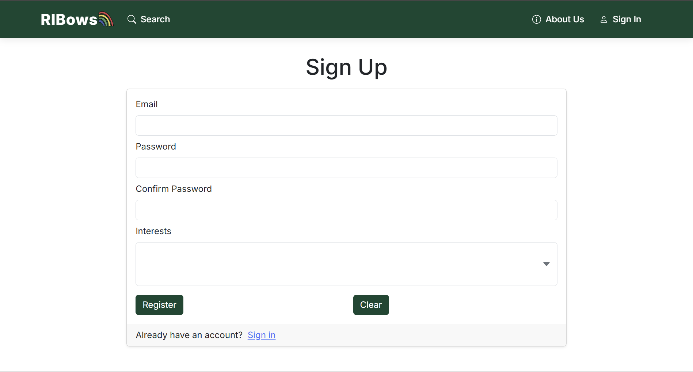

## Introduction

[RIBows](https://ri-bows.vercel.app/) is a website that helps University of Hawaiʻi at Mānoa (UHM) students search for, discover, and join Registered Independent Organizations (RIOs). The site supports both exploration and specific searching: users can browse trending organizations, filter by interests and keywords, and bookmark RIOs for quick access later. When a student finds an RIO they want to join, the "Contact" button allows them to quickly send an application directly to the RIO administrator. The overarching goal of the project was to reduce the barrier of finding RIOs—which was originally through a [Google Spreadsheet](https://docs.google.com/spreadsheets/d/1vK_ixq3a86uXjHXy9oNnyYHwAvyU9smNPKuJU6OYd-Q/edit?gid=1696807341#gid=1696807341)—and make RIO information more accessible and consistently up to date.

## Primary Contributions

My contributions spanned both the front-end and back-end of the application. On the front-end, I implemented the sign-in and sign-up pages and updated the site styling and theme to provide a more UH-aligned experience. On the back-end, I managed and refined the Prisma database models to fit the RIO dataset and support the application’s requirements; I initialized the bookmark data scheme to aid the team in implementing the bookmarking feature; and I interfaced the application with the official UH Manoa Approved RIOs Google Spreadsheet, parsed/stored its data, and created a Vercel cron job to refresh the database weekly.

## Conclusion

Through RIBows, I not only strengthened my web development abilities, but also gained experience working with a team. As the project evolved, the data modelling, background automation, and user interface needed to function together as a cohesive application, which presented some challenges related to communication and division of labor. Navigating these obstacles helped me grow as a collaborator and develop a better understanding of how to coordinate work across interdependent subsystems in a web development setting. I gained experience balancing schema design with transient requirements and coordinating changes across teammates without breaking the deployment. The project also reinforced best practices in version control, including writing clearer commits and learning how to navigate my team's commits and changes.

If you're interested in learning more about RIBows, check out our [Home Page](https://ri-bows.github.io/).