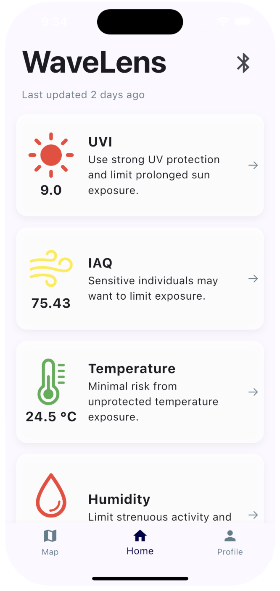
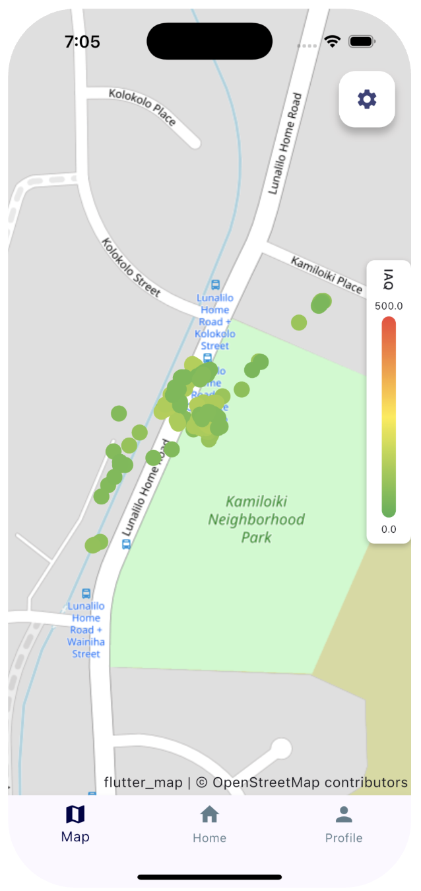

## Introduction

WaveLens is a portable environmental monitoring system designed to measure ultraviolet (UV) exposure, air quality, temperature, and humidity in real time. The motivation behind this project is the growing public health risk associated with prolonged exposure to UV radiation, poor air quality, and other extreme environmental conditions, particularly in outdoor settings. The system pairs a compact sensing device with a mobile application that enables real-time visualization and long-term data storage. Together, these components provide an accessible and affordable approach to environmental data collection that can support personal awareness and future public health decision-making.

    

## Primary Contributions

I served as both the electrical subsystem lead and software subsystem lead, overseeing the end-to-end design of the hardware and mobile application. On the hardware side, I designed a custom two-layer PCB featuring a Nordic BMD-340 system-on-module, a BME680 environmental sensor, and a LTR-390 UV sensor, all powered by a rechargeable lithium-ion battery with USB-C charging. I developed the device's firmware using the nRF Connect SDK and Zephyr RTOS, with BME680 data acquisition handled through Bosch’s BSEC library. I implemented Bluetooth Low Energy (BLE) peripheral functionality, user interaction via a pushbutton, and power management features such as sleep mode.

    
    

On the software side, I led development of the iOS mobile application using Flutter. The app connects to device nodes over BLE, visualizes sensor data through time-series plots and geographic heat maps, and stores data both locally and remotely. Local persistence was implemented using Drift, with periodic synchronization to a Supabase backend. 

## Conclusion

Through this project, I gained a lot of valuable experience in embedded systems design, BLE communication, full-stack mobile development, and cross-disciplinary system integration. The project taught me how to balance hardware constraints, firmware reliability, and user-facing software design when building a real-world sensing platform with a limited timeline.