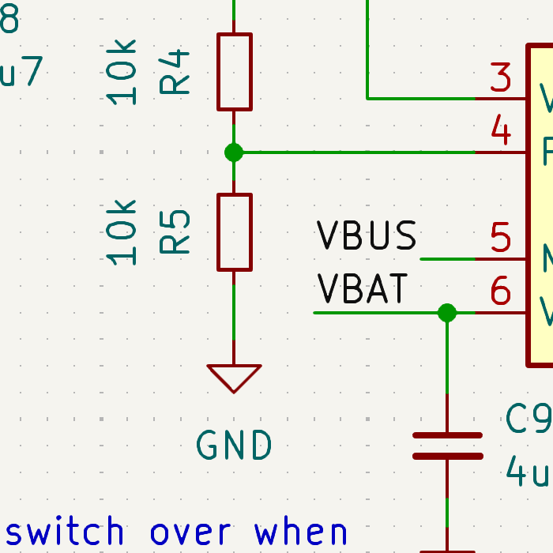

  

Wavelens is a project I am currently working on with a partner. The goal is to create and program a portable peripheral device capable of measuring various environmental parameters and communicating them via the Bluetooth Low Energy (BLE) protocol to a central device (a smartphone). The central device will digest, store, and visualize these data for end users through an associated app we're developing.

Below is a screenshot of the screen from which you can view nearby BLE devices and connect to the Wavelens node.

<figure>
  
  <figcaption>UUIDs are blacked out, and devices will be filtered by name to only show Wavelens devices.</figcaption>
</figure>
