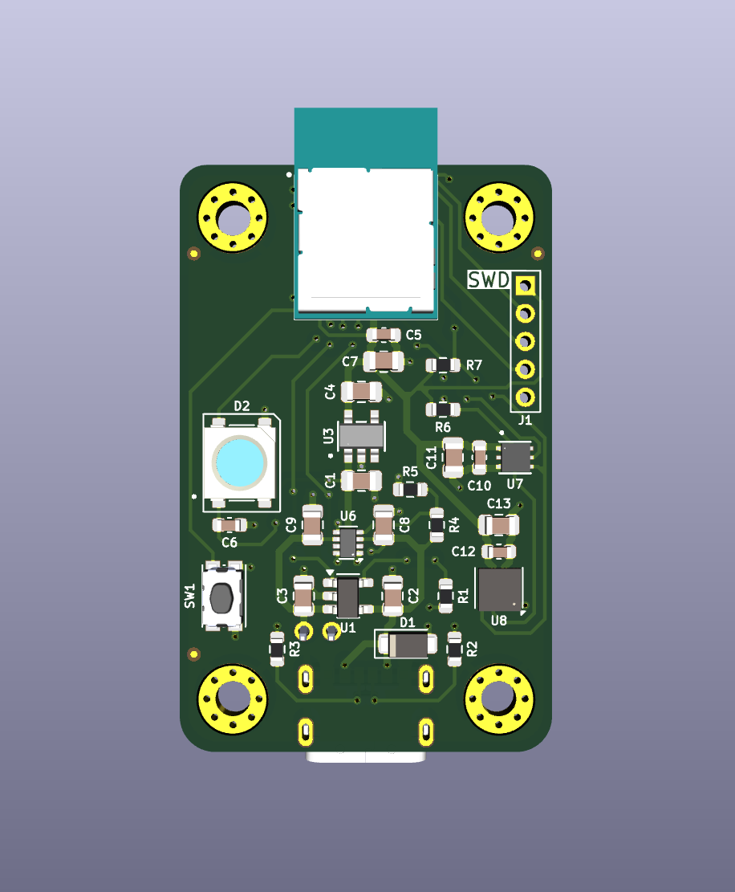
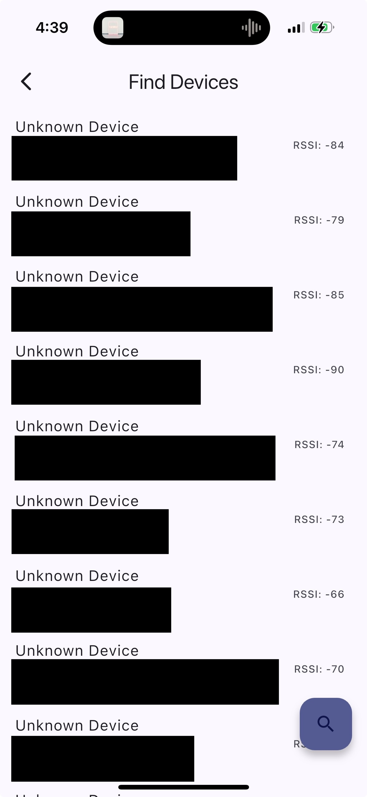

Wavelens is a project I am currently working on with a partner. The goal is to create and program a portable peripheral device capable of measuring various environmental parameters and communicating them via the Bluetooth Low Energy (BLE) protocol to a central device (a smartphone). The central device will digest, store, and visualize these data for end users through an associated app we're developing.

The following is a 3D render of the printed circuit board I designed for the peripheral Wavelens device:

  

Although the app is still in its early stages, it is coming together pretty well. Below is a screenshot of a page from which you can view nearby BLE devices (which will soon filter to only show our devices) and connect to a Wavelens node:

  <figure>
    
    <figcaption>Device scan screen, with the UUIDs censored.</figcaption>
  </figure>

This project has taught me a lot related to component selection, PCB design, embedded system firmware development, mobile app development, Bluetooth Low Energy, and the iterative design process.
